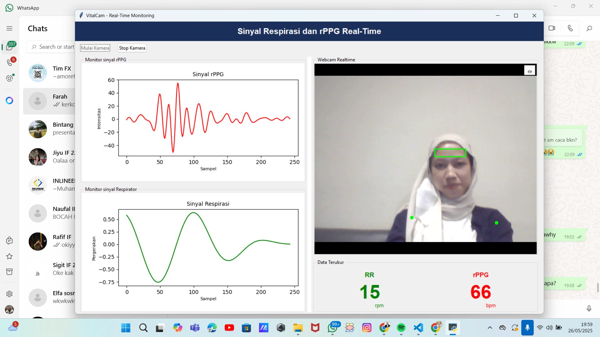

http://bit.ly/rsvp-tamct# Remote Photoplethysmography (rPPG) - Non-Contact Vital Sign Monitoring

## 📌 Deskripsi Proyek
Detak jantungmu, dari kamera biasa.
Proyek ini akan mengubah cara kita melihat vital sign—secara harfiah.
Tanpa alat khusus. Tanpa kabel. Hanya kamera dan kecerdasan.

Sistem remote photoplethysmography (rPPG) dikembangkan sebuah teknologi yang memungkinkan pengukuran detak jantung dan laju napas hanya lewat video wajah, tanpa kontak fisik sama sekali. Dengan menggabungkan kekuatan computer vision dan signal processing, sistem ini mendeteksi area dahi dan menangkap perubahan mikro pada warna kulit, lalu mengubahnya menjadi data biometrik secara real-time. Sistem ini juga memanfaatkan pergerakan bahu yang terekam di video untuk menghitung laju pernapasan. Dengan menganalisis pola naik-turun pada area bahu saat seseorang bernapas, sistem dapat memperkirakan ritme respirasi secara non-invasif, cukup dari kamera biasa.

Bayangkan memantau kondisi tubuh cukup lewat kamera laptop atau smartphone—tanpa ribet, tanpa sensor tempel. Teknologi ini punya potensi besar untuk diterapkan dalam telemedicine, pemantauan pasien jarak jauh, hingga kebutuhan personal seperti self-monitoring kesehatan harian. Lebih simpel, lebih nyaman, lebih masa depan.

---

## 👥 Anggota Kelompok
| Nama Lengkap               | NIM           | GitHub ID            |
|----------------------------|---------------|-----------------------|
| Cindy Nadila Putri         | 122140002    | [cindynadilaptr](https://github.com/cindynadilaptr) |
| M. Arief Rahman Hakim                      | 122140083    | [akuayip](https://github.com/akuayip)               |
| Zidan Raihan             | 122140100    | [zidbytes](https://github.com/zidbytes)               |
---

## 🗓️ Logbook Harian

| Tanggal | Progress                                                                 | Gambar                                                                 |
|--------|--------------------------------------------------------------------------|------------------------------------------------------------------------|
| 29/04/2025      | Membuat repository github                              |                                           |
| 11/05/2025      | Membuat requirements-txt, fitur respiratory dan rPPG                      |                                          |
| 17/05/2025      | Merancang GUI dan Try and Error Filter                  | Lupa dokumentasi :)                                                                                              |
| 25/05/2025      | Pembuatan GUI dan Laporan akhir tugas besar                  |                                                                                              |
| 26/05/2025      | Pembuatan GUI landing page dan main dashboard                  |                                                                                              |
| 27/05/2025      | Pembuatan GUI guide page dan credit page                  |                                                                                              |
| 31/05/2025      | Melanjutkan penyusunan laporan akhir tugas besar                              |                                           |
---

## 💻 Instruksi Instalasi

Panduan ini menjelaskan langkah-langkah untuk menyiapkan dan menjalankan project Python secara lokal **tanpa perlu melakukan clone dari GitHub**. Pastikan kamu sudah memiliki folder project di komputer (hasil download, ekstrak zip, atau salinan dari flashdisk).

1. Buka terminal atau command prompt untuk masuk ke direktori project yang akan dijalankan.
```bash
cd path/ke/folder-project
```

2. Buat dan aktifkan virtual environtment menggunakan uv untuk menjalankan kode program yang ada di dalam project, contoh:
```bash
uv venv --python=python3.10 # membuat virtual environtment
.venv/Scripts/activate # aktivasi venv windows
source .venv/bin/activate # aktivasi venv MacOS/Linux
```
3. Install library yang dibutuhkan program dari `requirements.txt`:
```bash
pip install -U -r requirements.txt
```
4. Jalankan program utama yaitu `main_dashboard.py` secara langsung, atau melalui terminal:
```bash
python main_dashboard.py
```

---


